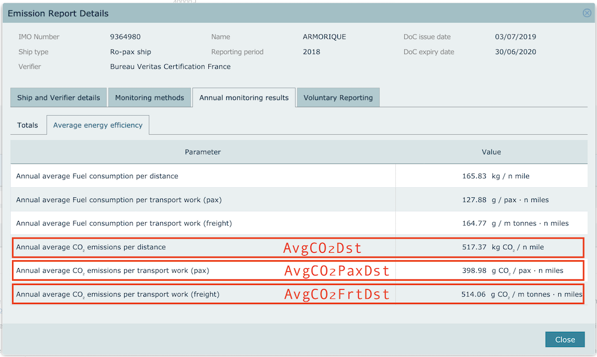

# Computed Statistics

## Raw THETIS data

You can find the officially published data on [THETIS publicly accessible platform](https://mrv.emsa.europa.eu/#public/emission-report).

## Inferred figures

### Distance travelled

`TotDst = TotCO₂ / AvgCO₂Dst`

*ie.* total emitted CO₂ / average CO₂ emitted per distance

*eg.* for the [Armorique](https://www.greenferries.org/ships/armorique-9364980) ship:

`TotDst = (36649.07 m tonnes * 1000) / (517.37 kg CO₂ / n mile) ~= 70837 n miles ~= 131191 km`

### Average number of persons transported

`AvgPax = TotCO₂Pax / (AvgCO₂PaxDst * TotDst)`

*ie.* total emitted CO₂ assigned to persons transport / (average CO₂ emitted per distance per person * total distance travelled)

*eg.* for the [Armorique](https://www.greenferries.org/ships/armorique-9364980) ship:

`AvgPax = (14841.17 m tonnes * 1000) / ((398.98
  g CO₂ / pax · n miles / 1000) * 70837 n miles) ~= 525 persons`

### Average freight transported

`AvgFrt = TotCO₂Frt / (AvgCO₂FrtDst * TotDst)`

*ie.* total emitted CO₂ assigned to freight transport / (average CO₂ emitted per metric ton of freight * total distance travelled)

*eg.* for the [Armorique](https://www.greenferries.org/ships/armorique-9364980) ship:

`AvgFrt = 21807.89 m tonnes * 1000 / ((514.06 g CO₂ / m tonnes · n miles / 1000) * 70837 n miles) ~= 599 m tonnes`

### Average speed

`AvgSpd = TotDst / H`

*ie.* total distance travelled / hours at sea

*eg.* for the [Armorique](https://www.greenferries.org/ships/armorique-9364980) ship:

`131191 km / 4801.00 hours ~= 27 km/h`

### Ratio of emitted CO₂ assigned to passengers

`RatCO₂Pax = TotCO₂Pax / TotCO₂`

*ie.* total emitted CO₂ assigned to persons transport / total emitted CO₂

*eg.* for the [Armorique](https://www.greenferries.org/ships/armorique-9364980) ship:

`14841.17 m tonnes / 36649.07 m tonnes ~= 40%`

## Code

If you want up-to-date and detailed formulas applied to compute the figures, please refer to [the code on GitHub](https://github.com/greenferries/greenferries).

The [ship.rb model file](https://github.com/greenferries/greenferries/blob/master/admin/app/models/ship.rb#L29) contains the important computations
